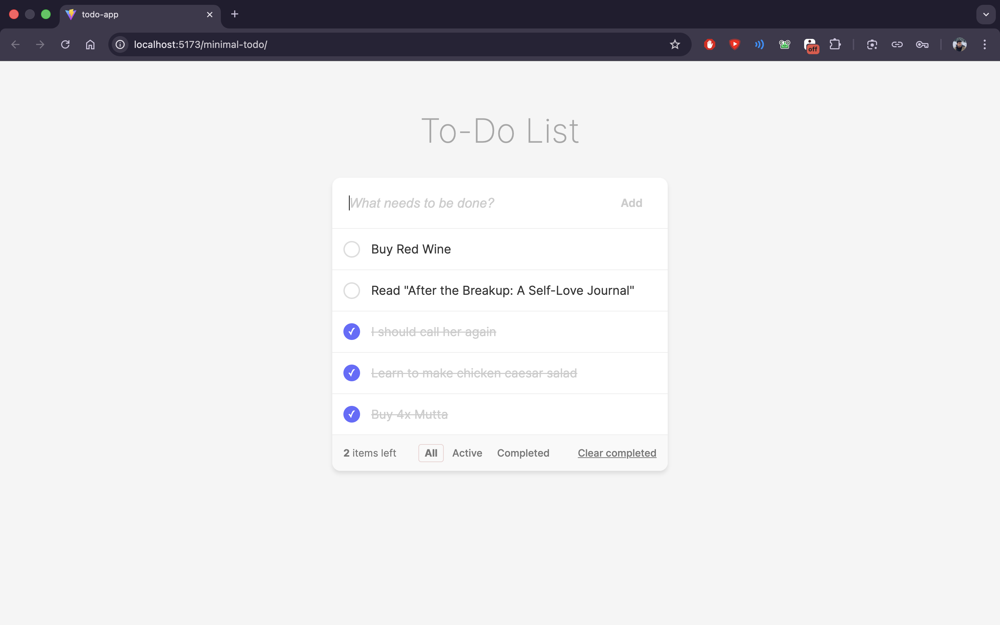

# Minimal To-Do List App

A clean, modern, and responsive To-Do List application built with React, TypeScript, and Vite.



## Features

- **Add Todos**: Quickly add tasks to your list.
- **Manage Status**: Toggle tasks between active and completed.
- **Filter**: View All, Active, or Completed tasks.
- **Delete**: Remove unwanted tasks.
- **Persistence**: Your data is saved automatically to your browser's local storage.
- **Modern Design**: Minimalist UI with smooth animations.

## Tech Stack

- **Framework**: React
- **Language**: TypeScript
- **Build Tool**: Vite
- **Styling**: Vanilla CSS (CSS Variables)

## Getting Started

Follow these instructions to get a copy of the project up and running on your local machine.

### Prerequisites

- Node.js (v14 or higher)
- npm or yarn

### Installation

1. Clone the repository:
   ```bash
   git clone https://github.com/probablynotnmp/minimal-todo.git
   ```
2. Navigate to the project directory:
   ```bash
   cd minimal-todo
   ```
3. Install dependencies:
   ```bash
   npm install
   ```

### Running the App

Start the development server:

```bash
npm run dev
```

Open your browser and visit `http://localhost:5173` (or the URL shown in your terminal).

## Building for Production

To build the app for production:

```bash
npm run build
```

## License

This project is licensed under the MIT License - see the [LICENSE](LICENSE) file for details.

## Author

**Prathyush N M**
- GitHub: [@probablynotnmp](https://github.com/probablynotnmp)
